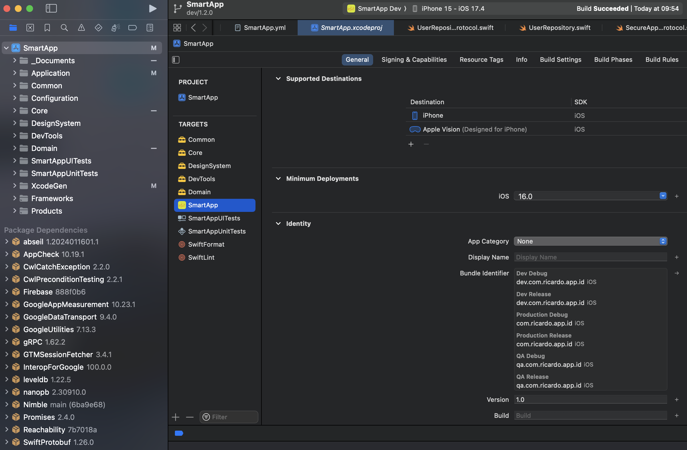
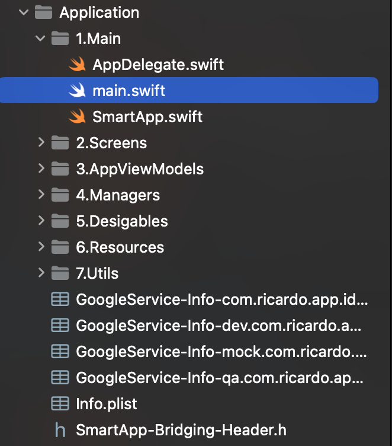
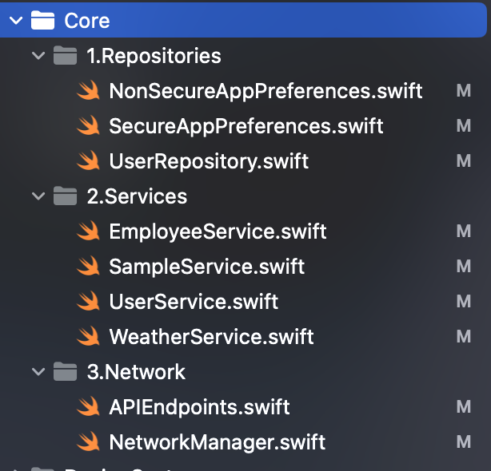

# SmartApp

__SmartApp__ is a modern iOS application built with _Swift_ and _SwiftUI_. __The project is designed to demonstrate the integration of various frameworks and tools for robust app development using SwiftUI__. It features a well-organized structure with support for _Unit testing_, _UI testing_, and various configurations.

## Project Overview

SmartApp is structured using XcodeGen, which simplifies the management of Xcode projects by using YAML configuration files. This approach ensures consistency and ease of maintenance across different environments.

### Dependencies
 * __Firebase__: Integrated for various backend services including authentication, real-time database, messaging, and analytics.
 * __Nimble__: A matcher framework for writing expressive tests.
 * __Reachability__: A library for network reachability.

## Project Structure (Targets)

The project is organized into several key directories and targets, each serving a specific purpose:

### SmartApp

The main application target, integrating various libraries and frameworks to deliver the core functionality and user interface of the app.

### Core

This target encapsulates the core functionality of the application, providing essential features and services.

### Common

A shared framework that includes extensions and utility functions used across multiple targets, promoting code reuse and modularity.

### DesignSystem

This target houses design-related components and dependencies, ensuring a consistent and reusable visual style throughout the application.

### DevTools

Includes various development tools and utilities such as logging, facilitating smoother development and debugging processes.

### SmartAppUnitTests

Contains unit tests for the SmartApp, ensuring that individual components function correctly.

### SmartAppUITests

Contains UI tests for the SmartApp, validating the user interface and user interactions to ensure a seamless user experience.

## Project Structure (File Groups)

### File Groups
  - **Documents**: Includes document-related files.
  - **Configuration**: Contains configuration files for different environments.
  - **XcodeGen**: YAML files for configuring the Xcode project.

### Configuration

The project supports multiple configurations including `Production`, `QA`, and `Dev`, with specific settings for `Debug` and `Release` builds. Configuration files are located in the `Configuration` directory and are referenced in the Xcode project settings.

### Build Scripts

- __SwiftLint__: Enforces Swift style and conventions.
- __SwiftFormat__: Automatically formats Swift code according to style guidelines.

### Project Setup

Run `./makeProject.sh` and project and all dependencies will be installed

