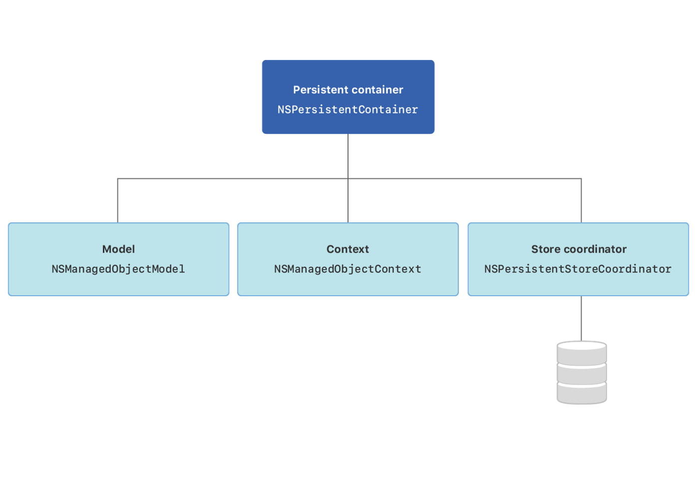

# Notes

## NSPersistentContainer

* __NSPersistentContainer__ handles the creation of the Core Data stack and offers access to the __NSManagedObjectContext__ as well as a number of convenience methods.

## NSManagedObjectModel

* __NSManagedObjectModel__ describes the data that is going to be accessed by the Core Data stack. During the creation of the Core Data stack, the __NSManagedObjectModel__ is loaded into memory as the first step in the creation of the stack. After the __NSManagedObjectModel__ object is initialized, the __NSPersistentStoreCoordinator__ object is constructed.

## NSManagedObjectContext

* __NSManagedObjectContext__ is the object that your application will interact with the most. Think of it as an intelligent scratch pad. When you fetch objects from a persistent store, you bring temporary copies onto the scratch pad where they form an object graph. You can then modify those objects however you like and if you choose to save the changes you have made, the context ensures that your objects are in a valid state. If they are, the changes are written to the persistent store, new records are added for objects you created, and records are removed for objects you deleted.

## NSPersistentStoreCoordinator

* __NSPersistentStoreCoordinator__ sits in the middle of the Core Data stack. It is responsible for realizing instances of entities that are defined inside of the model. It creates new instances of the entities in the model, and it retrieves existing instances from a persistent store (__NSPersistentStore__) which can be on disk or in memory depending on the structure of the application.

## Considerations 

 * A `NSManagedObjectContext` must perform operations on the thread it was created
 
 * `NSManagedObject` is not thread safe. However, `NSManagedObjectID` is thread safe.
 
 * `save()` and `fetch(_:)` are not thread safe. However, `perform(_:)` and `performAndWait(_:)` are thread safe.
 
